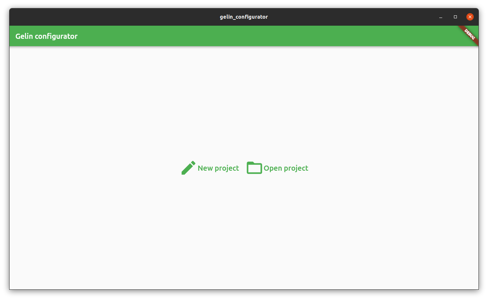
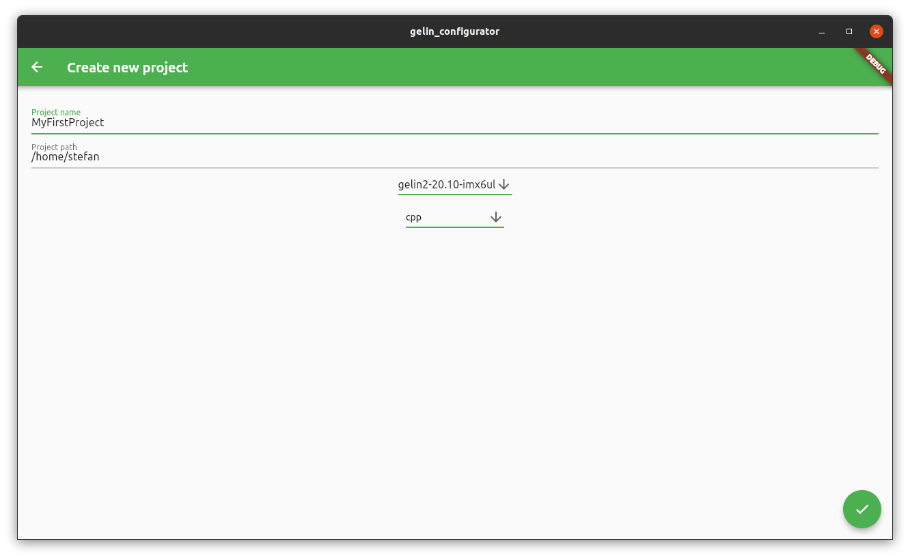
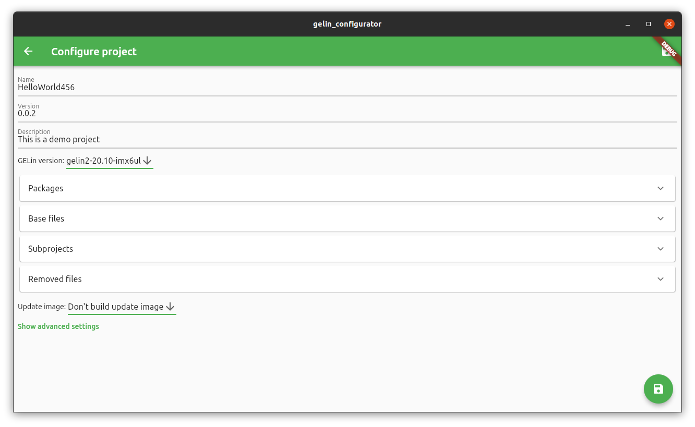
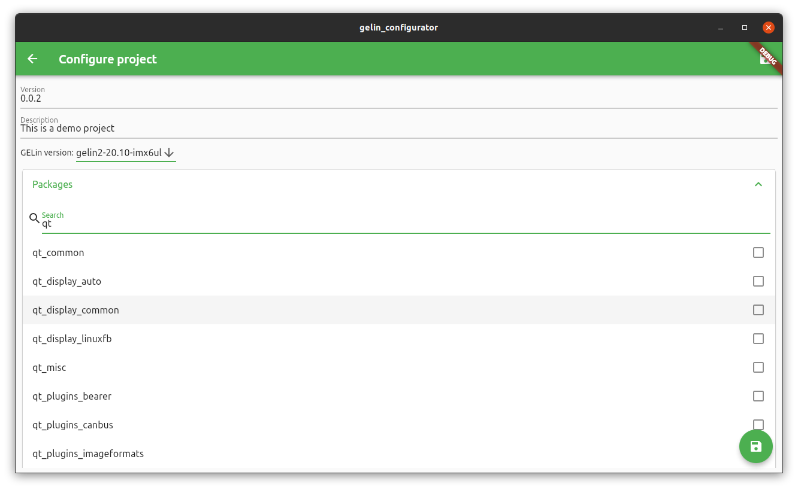
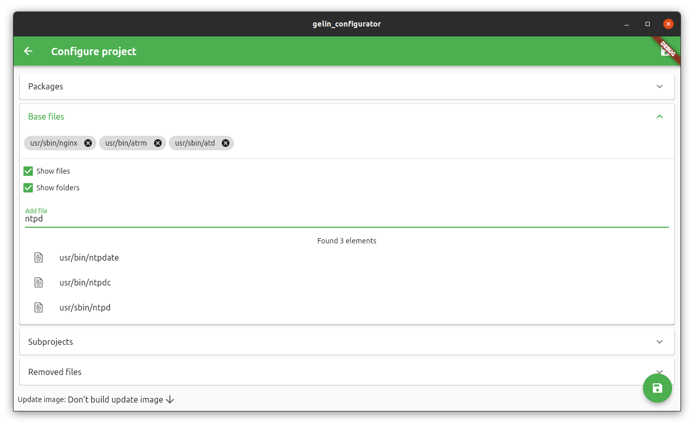
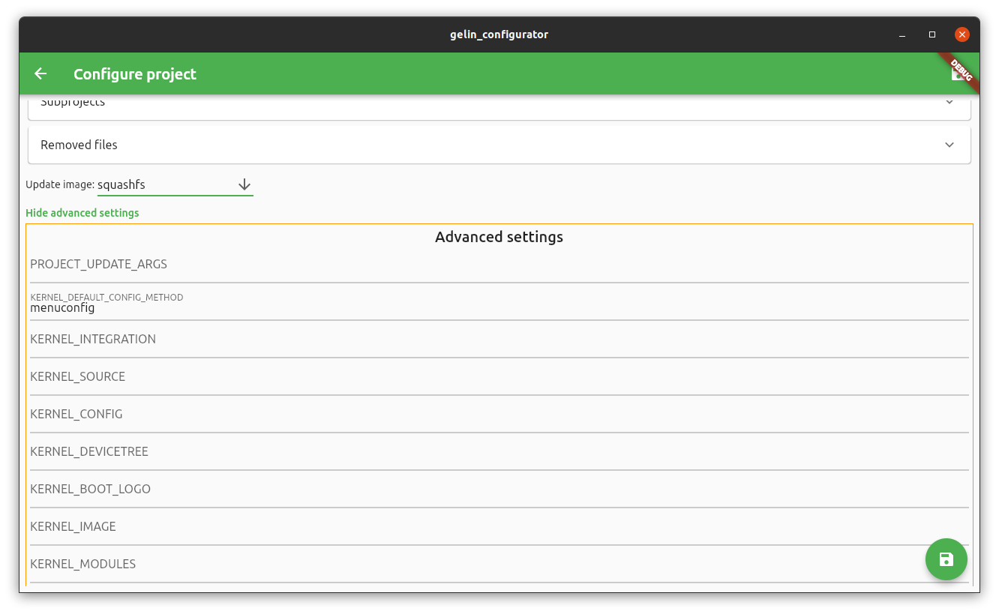

# gelin_configurator

Goal of this project is to aid GELin users with creating and configuring their projects. I wrote this tool in my spare time. I do not have any affiliation with Ginzinger electronic systems.

I am not a UI/UX designer and thus the interface might look a little bit rough and not as aesthetically pleasing or intuitive as would be ideal.

Feel free to use it if you wish. However, I do not guarantee that it will work, do what you want or does not destroy your computer. Use at your own risk.

## What is GELin?

GELin is a "Linux building toolkit" by Ginzinger Electronics which is focused on ease of use and abstracting many of the system builder hassles from the developer, so the developer can focus on their business logic and applications. You can find more information about GELin [here](https://www.ginzinger.com/en/technologien/embedded-linux/).

## Screenshots













## Supported features

- Create new projects
  - Set name and path
  - Choose GELin version to base the project on
  - Choose a project template 
  - Add Base files
- Modify existing projects
  - Change name, version number and project description
  - Change used GELin version (automatically scans for installed GELin on your computer in /opt/)
  - Add/Remove packages
  - Add/Remove subprojects
  - Add/Remove files
- Save changes

More is WIP

## Running it on your machine

1. First step: Set up dart and flutter SDK as described [here](https://flutter.dev/desktop)

2. Open the folder containing this project in a terminal

3. run

   ```bash
   flutter build linux
   ```

4. the release binary can be found at *build/linux/release/bundle/*  (to use it on a different system, also include the data and lib folders)

You can also download the zip file from the Releases folder on my git.

## Known bugs

- checking for gelin project validity not 100% accurate
- can overwrite comments in files if they have the same structure like real arguments (e.g. #KERNEL_IMAGE="")